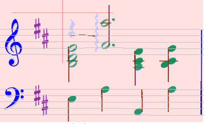
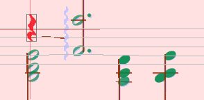
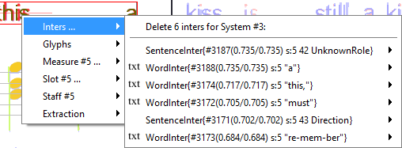
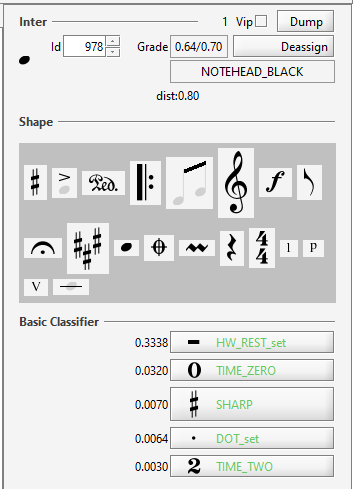
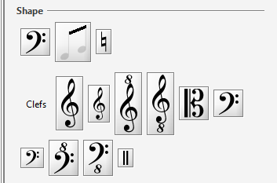

---
---
## Editing Entities

Audiveris checks whether the chords for each measure fit to the detected time signature.
If not, it marks the measure by filling it in rose color:

In this case a rest has not been detected.
Just mark the rest (either by selecting the glyph directly, or by putting a selection frame around)

and look at the list of basic classifier.
Often the correct interpretation is listed there and can directly be selected.

### Context menu {#context-menu}

With a right click on an object or a group of selected elements in the sheet view,
you get a pop-up menu whose contents depends on the current context.

From option "Inters" you have two main possibilities:

* delete the detected interpretations of the selected objects (top option)
* delete relations for each selected element.

Option "Glyphs" allows you to define new interpretations for all selected elements at a glance.
It builds a "compound" glyph (built by combining all the selected glyphs) and submit it to the
classifier.

Be sure to have deleted the wrong interpretation before, and to have really only selected elements
of the same type.

### Boards {#boards}

On the right you find the boards window that gives you information about the selected element (top)
and allows you to define new interpretations of it.

* Classifier
  Displays the result of the glyph evaluation by the neural network evaluator.
  The top 5 best shapes are displayed, with their related grade in range 0..1.

* Shape  
  The shape palette gives access to shape families.
  Within a family, a shape can be assigned (by double-click) or dragged and dropped to a target
  location.

The shape palette opens a new list of elements for each presented item

In the top line, you get a list of the most recent element types you have used.
They are available for direct access.

In order to (re-)define a glyph with a new interpretation you can either

* double click on the wished interpretation (the glyph must be selected)
* drag-n-drop the element to the wished position

Some shapes cannot be set by drag-n-drop. These are:

* physicals (lyrics, texts,...) except for ledgers and stems.

These elements can only be assigned by selection of the glyph and double click
or keyboard short-cut.
