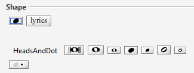

## Shortcuts
{: .no_toc }

In order to make editing easier there are a couple of keyboard short-cuts that allow to assign
interpretations to selected glyphs.

They all work with 2 keyboard strokes:
the first one selects a family (group) of shapes, the second one selects a shape within the family.

Only families and shapes that are used rather often are supported (see detailed list below).

## Table of contents
{: .no_toc .text-delta }

1. TOC
{:toc}

---

### Assign an interpretation to selected glyph

After the selection of a glyph (perhaps built as a compound of selected sub-glyphs),
the described 2-step shortcut can be used to assign the correct interpretation.
You will see the selected shapes families on the right column after the first key press
and the final used interpretation at the left-most position of the last used shapes.

In this example, pressing `p` and `l` assigns the selected items as lyrics.

### Select an interpretation for quick access from the list of shapes

If you cannot select the glyph(s) in advance but want to position the shape using the mouse,
you can select a shape in the list of shapes for quick access in the same manner:
after the 2nd key stroke the selected shape will appear on the left-most position of shapes
so that you can easily drag-n-drop it to the desired location.

Example: press `h` and `b` and you get the black head into the list of shapes.

### List of supported shortcuts

The following shortcuts are supported:

`a` (accidentals family)

* `f`(flat), `n`(natural), `s`(sharp)

`b` (beams family)

* `f`(full), `h`(half), `3`(triplet)

`d` (dynamics family)

* `p`(piano), `m`(mf - mezzoforte), `f`(forte)

`f` (flags family)

* `u`(up), `d`(down)

`h` (heads family)

* `w`(whole), `v`(void), `b`(black), `d`(dot - augmentation dot)

`r` (rests family)

* `1`, `2`, `4`, `8` (full, half, quarter, eighth)

`p` (physicals family)

* `l`(lyrics), `t`(text), `a`(arc - slur), `s`(stem)
