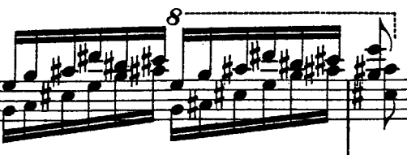
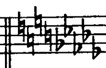
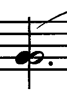

---
---
## Limitations

This section presents the known cases that current Audiveris does not handle properly.
These are "known limitations", which should be addressed in future releases.

It is important that the end user be aware of these cases to avoid wasting time on them
with the current release.
Apart from these cases, you can fill a bug report or a request for enhancement on 
[https://github.com/Audiveris/audiveris/issues](https://github.com/Audiveris/audiveris/issues).

We make a distinction between different kinds of OMR limitations:
* **Data model**: There is nothing yet in Audiveris data model to simply describe the entity at hand.  
  This is the worst case, because the user will have to resort to some external music editor on
  Audiveris MusicXML output to enter the missing entity from scratch.
* **Engine**: The data model is OK, but the OMR engine is not able to automatically detect and
  process the entity correctly.  
  In many cases, using Audiveris editor, the user should be able to manually modify the engine
  output and thus allow correct production of MusicXML.
* **Editor**: The data model is OK, but the current editor does not provide the interactive feature
  to perform a desired action.
  See [Editor Limitations](../edition/editor_limitations.md) dedicated section.  
  Use of an external music editor on Audiveris MusicXML output may bring a solution.

### Data model Limitations

#### Tablature

There is no support for tablature staff (the one with the "TAB" clef).

#### One-line percussion staff

There is no support for 1-line percussion staff.

Current Audiveris supports only percussion clef with standard notes on 5-line staves as in
the following example:

#### Tremolos

Audiveris supports no tremolo, whether on a single note or between two notes.

#### Ottava

Ottava signs (ottava alta and ottava bassa) are used to indicate an octave shift between what is
written on staff and what should be played.

Their scope is specified by a dash-line that starts at the ottava sign and ends with a small
vertical leg.

Although the ottava sign is properly defined and generally recognized by the current engine, there
is yet no support for the dash-line nor the small vertical leg.

#### Natural signs in key signature

In current data model, a key signature is assumed to contain only sharp signs or only flat signs.
There is yet no room in them for natural signs.

Such natural signs are just "curtesy" signs for the reader, and can be ignored by OMR.

Note however that, since the current engine expects sharps-only or flats-only signatures,
the simple presence of natural signs will likely impede correct key recognition.
In this case, the user will have to manually enter the correct key (without the naturals).

### Engine Limitations

#### Key signature change

A key signature appears generally at the beginning of a staff, within what Audiveris calls the staff
"header" (a sequence of: clef, optional key signature, optional time signature).
Generally, the engine correctly handles a key signature in header, simply because it knows
precisely where to look.

But later down the staff, a key change may appear.
And this "new" key is not yet handled by the engine.

Such change often appear in a "curtesy measure", located at the end of the staff and containing no
music note.
The purpose of a curtesy measure is simply to warn the human reader that a new key will occur at
the next system start.
It is thus harmless for the OMR engine to ignore this warning.

Apart from this curtesy case, the user will have to manually enter the missing key change on every
staff.

#### Opposed Stems

We can have two head chords with up and down stems that are located in such a way that they seem
to be merged, as follows:

The OMR engine may detect just one long stem, instead of two aligned ones.
The problem is that this single stem has some heads attached near the middle of the stem,
but no head on any stem end.
At the next reduction, this stem will be discarded, and the now isolated heads as well.

This error can be fixed by manually inserting separate standard stems (and the related heads).
