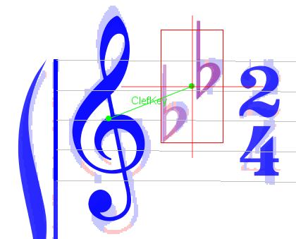

---
---
### Symbol Interpretation Graph

#### Relation

A Relation instance formalizes a relationship between a source Inter instance and a (different)
target Inter instance.

There are 2 main kinds of relation:
* A positive relation represents a **mutual support** between two Inter instances.  
A typical example is a black head interpretation and a stem interpretation nearby with a suitable
connection between them.  
Support relations increase the contextual grade of their linked Inter instances.
Doing so, even rather low-quality interpretations, when well combined through supporting relations,
may end up with acceptable contextual quality.

* A negative relation represents a **mutual exclusion** between two Inter instances.  
It tells that the two Inter instances cannot coexist in the final configuration, so at least one of
them will disappear at some point in the process.

The image below shows a rather high level of relation:  
We can see two Inter instances (a treble clef followed by a 2-flat key) linked by a supporting
ClefKeyRelation instance (shown as a labelled green segment).  
This is so because the pitches of all flat signs in this key are compatible with a treble clef.  
If ever there was a competing bass clef, there would be an ExclusionRelation between the bass clef
and this key.

#### SIG

A Symbol Interpretation Graph (SIG), is simply a graph with Inter instances as vertices and
Relation instances as edges.

This SIG plays the central role in Audiveris V5.
Its main purpose is to formalize and manage the mutual exclusions and the supporting relations
within a population of candidate interpretations.

There is one SIG per system, and at some points in OMR pipeline (typically the REDUCTION step and
the LINKS step), the SIG is _reduced_ so that no exclusion remains in its graph.
