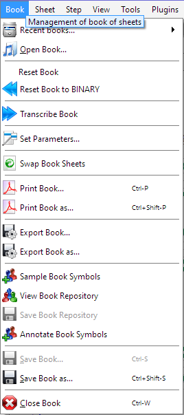

## Book menu

A book is a collection of one or more sheets, each with its current state of transcription.
It can be saved and reloaded at any time during a processing session.

As opposed to [Loading an image ](../quick/load.md) which restarts from the initial image,
loading a saved book allows to resume processing from the last step saved.
This is especially useful for processing books with many sheets.

### Recent Books

Open a list of recently saved books.
After selection, the book is opened in the state it was saved.

### Open Book

Open a dialog box allowing to select a book that has been saved before.

### Reset Book

Reset all sheets of a book to the initial state, as if it were just loaded as a plain image

### Reset Book to Binary

Same as `Reset Book` above, except that the initial processing of the images from grey-scale to
B&W image is kept.

### Transcribe Book

Start the transcription of all sheets of a book.

Transcription is by default performed sheet by sheet.
During processing, the user may start editing sheets that have already been transcribed.

### Set Parameters

Modify parameters for transcription.
See [Score parameters ](../main/score_parameters.md).

### Swap Book Sheets

Swap to disk all the sheets of current book (except the current sheet).

This is useful to save memory when working on a book with numerous sheets.
When needed, a swapped sheet is transparently reloaded.

### Print Book

Save the transcribed book in PDF format, so that it can be printed or saved for further purposes.
The name of the output file is derived from the book name.

The file is saved into book folder, a (newly created) subdirectory of the base output directory.

### Print Book as

Same as above, except that the user can define the file name and the directory where the file is saved.

### Export Book

Export the transcribed score as a MusicXML `.mxl` file for exchange with a notation program.
See [Outputs Formats](../main/output_formats.md).

The file is saved into book folder, a (newly created) subdirectory of the base output directory.

### Export Book as

Same as above except that the user can define the file name and the directory where the file is saved.

### Sample Book Symbols

Populate the book sample repository with samples derived from relevant inters of all book sheets.

(needs `SAMPLES` topic, see [Samples section](../advanced/samples.md))  

### View Book Repository

Open a window to browse, check and filter the samples of book repository.

(needs `SAMPLES` topic, see [Samples section](../advanced/samples.md))

### Save Book Repository

Save book sample repository to disk into book folder.

(needs `SAMPLES` topic, see [Samples section](../advanced/samples.md))

### Annotate Book Symbols

Populate a Zip archive with images and symbol annotations derived from book Inter instances.

These annotations are meant to populate a dataset for training the coming Audiveris 6.x new
classifiers (Page and/or Patch).

(needs `ANNOTATIONS` topic)

### Save Book

Save the collection of all book sheets with the current state of transcription.

The file is saved into book folder, a (newly created) subdirectory of the base output directory.

### Save Book as

Same as above except that the user can define the file name and the directory where the file is saved.

### Close Book

Close the current book and releases all its resources.

If the book has some unsaved data, the user is prompted to save it before closing.
