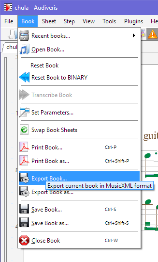

---
---
## Export

From the input image, Audiveris OMR engine has gradually built specific information that we
collectively refer to as "_OMR data_".

In the advanced chapter, we describe more thoroughly how this OMR data is organized, can be
persisted on disk (in a `.omr` file) and directly reused by Audiveris or other external programs.

Right now, we are focused only on how to feed a music sequencer with music data it can easily import.  
And as of this writing, this is achieved by going through MusicXML-formatted data.

We thus have to export OMR data as MusicXML data.  
This can be done via pulldown menu `Book | Export Book...`:

From our "chula" example, this command produces a file named `chula.mxl` (compressed MusicXML).

All output files related to a given input file are gathered into one specific folder
(the "book folder"), named according to the input file name.
In our concrete example, the book folder ("chula") will contain the export file ("chula.mxl").

The default location of all "book folders" depends on the operating system.
For Windows OS, the default location is the "Audiveris" sub-folder of user's Documents folder.
More details are available in [Folders](../folders) chapter.

Note that this export is lossy, since a large amount of OMR information can't go into MusicXML.
A `.omr` file can always be used to regenerate the `.mxl` export, but the reverse is not true.
